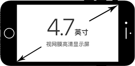
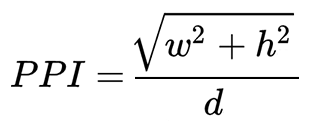

# 屏幕尺寸、像素、分辨率和 devicePixelRatio
## 目录
- [想法](#think)
- [屏幕尺寸](#screen)
- [像素](#pixel)
- [分辨率](#resolution)
- [devicePixelRatio](#devicepixelratio)
- [参考资料](#reference)
##  想法
最开始写页面的时候，对页面里面的px还是蛮好奇的，电脑上的分辨率好像正好跟页面渲染的宽度值对应，但手机里面却不是这样的，记得当时还去找了相关资料，好像知道是怎么回事。最近脑海里再次想起了这个问题，但已经不知道该如何表述，又没有相关的笔记，这个觉得有必要区分一下相关的概念。
##  屏幕尺寸
屏幕尺寸是指屏幕对角线的尺寸，经常看到的描述是英寸（缩写in），1in = 2.54cm。

##  像素
像素是屏幕上图像显示的最小可控元件，它不是一个点或者一个方块，而是一个抽象的取样。每个像素都有颜色，颜色通用用3或4个分量表示，例如RGB方法用红、绿、蓝三原色的光学强度表示一种颜色，CMYK方法用青、品红、黄、黑四种颜料含量来表示一种颜色，CMYK色域在印刷行业和打印机常见。

一个像素通常被认为是数字图像中的最小单位。在不同的上下文中，像素的含义可能不同，例如视频中的像素，打印时的像素，显示屏的像素，或者数码相机（感光元素）中的像素。根据语境的不同，会有一些更为精确的同义词，例如取样点，字节，比特，超集，斑等等。

### 设备像素
设备像素是指设备中使用的真实像素，也叫物理像素。在同一设备中，像素的总数是固定的。

### 像素密度PPI和DPI
PPI（pixels per inch）是指每英寸的像素数目，常用于度量计算机显示设备像素密度。

DPI（dots per inch）是指每英寸数码印刷的点数，用于度量印刷行业的空间点的密度。

理论上，PPI是可以通过已知的对角线尺寸和屏幕分辨率计算出来。可以通过下面的公式计算：

- w是水平方向上的像素数
- h是垂直方向上的像素数
- d是屏幕尺寸

例如21英寸屏幕，分辨率为1920*1680，那么w=1920，h=1680，d=21，带入计算的PPI=121.49。

### CSS像素
CSS像素是编程中的概念，用于逻辑上衡量像素的单位。

##  分辨率
分辨率（Image resolution）泛指量测或显示系统对细节的分辨能力。从不同方面描述，有像素分辨率、空间分辨率、光谱分辨率和时间分辨率。平常接触大部分是像素分辨率，例如常说的视频分辨率、显示分辨率和图形分辨率。这里暂只讨论像素分辨率类别。其它类型的相关介绍在[这里](https://en.wikipedia.org/wiki/Image_resolution)。

### 屏幕分辨率
屏幕分辨率是屏幕显示的像素总数，再细分一下就有：物理分辨率和显示器分辨率。
- 物理分辨率是显示器的固有参数，不能调节，一般是指屏幕的最高可显示的像素数。
- 显示器分辨率就是操作系统设定的分辨率。在显示器分辨率和物理分辨率一致时，显示效果才是最佳的，一般推荐设置的分辨率就是物理分辨率。系统设置分辨率生效是通过算法进行了转换。

举个例子，在手机上的看关于手机信息，可以看到分辨率信息为720*1280，意思就是屏幕水平方向上有720个像素，垂直方向上有1280个像素。
### 图像分辨率
图像分辨率就是单位英寸中所包含的像素总数。图像分辨率的表达方式也为“水平像素数×垂直像素数”。例如一张图片的分辨率是320*289,意思就是图片水平方向上有320个像素，垂直方向上有289个像素。

##  devicePixelRatio
这里是指javascript中的window.devicePixelRatio，它是设备上物理像素和设备独立像素（device-independent pixel，dips，dp）比值。用公式表达就是：devicePixelRatio = 物理像素 / 设备独立像素。这个也可以解释为[CSS](https://developer.mozilla.org/en-US/docs/Web/CSS)像素和物理像素的比例，简单来说，它告诉浏览器需要多少物理像素来绘制一个CSS像素。这个属性可以用来区分视网膜设备和非视网膜设备。

设备独立像素也叫逻辑像素，是一种基于计算机坐标系统的物理测量单位，应用程序将独立像素告诉系统，系统再将设备独立像素转换为物理像素。以设备独立像素定义的尺寸，不管屏幕的参数如何，都能以合适的大小显示。在IOS视网膜设备上，screen.width返回就是dips，Andioid设备上screen.width的不一定是dips。

##  参考资料
- https://en.wikipedia.org/wiki/Pixel
- https://zh.wikipedia.org/wiki/%E5%83%8F%E7%B4%A0
- https://zh.wikipedia.org/wiki/%E4%BD%8D%E5%9B%BE
- https://en.wikipedia.org/wiki/Pixel_density
- https://en.wikipedia.org/wiki/Image_resolution
- https://zh.wikipedia.org/wiki/%E5%88%86%E8%BE%A8%E7%8E%87
- https://www.jianshu.com/p/c3387bcc4f6e
- https://developer.mozilla.org/en-US/docs/Web/API/Window/devicePixelRatio
- https://www.quirksmode.org/blog/archives/2012/06/devicepixelrati.html
- https://developer.mozilla.org/en-US/docs/Web/API/Window/devicePixelRatio
- https://en.wikipedia.org/wiki/Device-independent_pixel
- http://yunkus.com/physical-pixel-device-independent-pixels/
- https://segmentfault.com/a/1190000011753855

:wastebasket:

最近看《伊索寓言》，里面的一些看法很有趣，比如关于乌龟的一则故事：

![11-poster][url-local-story]

[url-local-story]:./images/11/story.jpeg