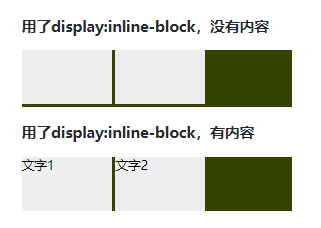
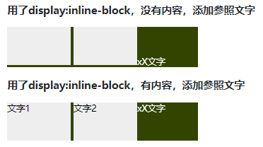
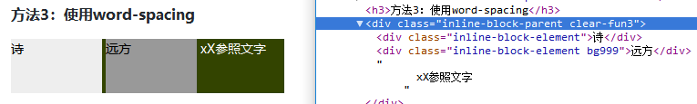
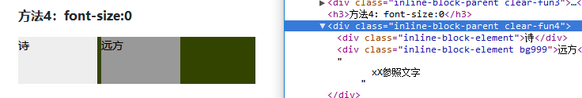

# 关于`display: inline-block`产生的间隙
## 目录
- [想法](#think)
- [约定](#convention)
- [现象](#phenomenon)
- [原因](#reason)
- [去掉间隙的方法](#ways)
- [感受](#feeling)
- [参考资料](#reference)
## <a name="think"></a> 想法
最近在看自己笔记的时候，看到了关于`display: inline-block`产生的间隙的记录，就简单的记录了一下，自己完全不能回忆起来。随即在网上搜了一下，相关的博客也是蛮多的，但里面的讲解不太符合个人的理解方式，还是自己回顾，详细记录一下。
## <a name="convention"></a> 约定
以下所有的示例基于的html结构如下：
```html
<div class="inline-block-parent">
  <div class="inline-block-element"></div>
  <div class="inline-block-element"></div>
</div>
```
这里对不同内核浏览器进行了验证，并没有对所有的浏览器进行验证。验证系统：Windows。验证浏览器有：
- Chrome-65.0.3325.181（64位）
- Firefox-59.0.2(64位)
- ie11
- Safari-5.1.7（7534.57.2）
关于Safari要说一下，2012年7月26日，随着苹果的“山狮”系统发布，Windows平台的Safari已经放弃开发，在一些使用浏览器统计数据中也看不到这款浏览器的具体占比。

以下所讲示例页面：[关于display: inline-block产生的间隙示例](https://xxholic.github.io/lab/lab-css/inline-block.html)

手机端浏览


## <a name="phenomenon"></a> 现象
在比较早的时候，不少的布局是用`float`属性完成。随着标准和浏览器的不断更新，布局的方式变多，原本目的不是用来布局的`float`属性，逐渐不被提倡使用。例如比较常见的横向排列布局，就可以利用`display: inline-block`的特性进行完成。但这个方式有一个问题：会出现间隙，间隙在水平和竖直方向都有。如下图所示。



## <a name="reason"></a> 原因
先来了解这个属性值的含义，`display`值为`inline-block`会导致一个元素生成偏内联级别特性的块容器，这个元素的内部被格式化为块级盒子，元素本身被格式化为一个单独的内联级别盒子。也可以说这样的元素，既有块级元素的特性，又有内联元素的特性。一些教程里面翻译过来叫行内块元素，这个标准属性是在CSS2.1中才出现，但ie在很早的时候就实现了自己的inline-block。

从网上查询得知间隙是由空白符（white space）造成。那么在CSS里面什么是空白符？查询资料得知，在CSS语法中，在空白区域，只有空格(U+0020)、制表符(U+0009)、换行(U+000A)、回车(U+000D)、换页(U+000C)才会被视为语法的一部分，这些插入文档时，产生的就是空白符。

在资源里面的换行的呈现，可能是一个回车符（U+000D），一个换行符(U+000A)，或者由回车符和换行符的组合，或者是其它的识别文档开始和结束的部分机制。CSS属性`white-space`处理模型假定所有的换行已经被标准化为换行符。用户代理识别到换行后的呈现，必须要应用CSS属性`white-space:normal`处理规则。如果文档语言没有特定的换行规则，那么文档文本中的每个回车符和连续的回车换行符，都处理为一个换行符。默认的标准规则也会应用生成内容。空格和Tab也有对应处理规则，更加详细的可以参考[这里](https://www.w3.org/TR/CSS22/text.html#x12)

由以上就可以知道，在写html代码的时候，为了方便观看和维护，都用了适当的换行和空格，而这些字符，也将应用CSS属性`white-space`产生了内容，所以就产生了间隙。但上面的图片为什么在竖直方向上一个有间隙，一个没有间隙？都是相同的html结构，只是其中一个有文本，怎么就会这样子。

根据前面的介绍，了解到应用`display: inline-block`后，元素就会按照内联元素进行摆放，内联元素的对齐方式由属性`vertical-align`决定，那么是不是这个导致的呢？为了更加直观，在后面多余的区域加几个文字看看效果。



这个就明显很多了，好像真的是对齐的缘故，`vertical-align`默认的属性值是`baseline`，它的含义就是：一个盒子的基线与其父盒子的基线对齐，如果这个盒子没有基线，那么这个盒子的margin边界跟父元素的基线对齐。基线这个含义没有找到比较清晰明确的定义，就用《CSS权威指南》的一张图直观的感受一下。


对于`inline-block`的情况，文档里面`baseline`的定义有相关的说明：`inline-block`一类元素的`baseline`是其子元素在正常文档流中最后一个行框的`baseline`，如果它里面没有行框或者设置了`overflow`属性值为`visible`之外的属性，那么它的`baseline`就是它自己的底部外边距边界。

这样子就差不多可以理解了，然后对产生的原因做一个简短的总结：

由于写html代码的方式，文档里面产生了一些看不见的字符，CSS的`white-space`属性会作用于这些字符，产生了内容，占据了空间，产生了水平方向上的“间隙”效果；都是字符，`font-size`和`line-height`属性当然也是会生效的，由此产生了行框，只不过看不到；在文档流里面格式化时，由于`vertical-align`属性的作用，字符的基线跟`inline-block`元素的基线对齐，可能会出现垂直方向上有“间隙”的效果。

## <a name="ways"></a> 去掉间隙的方法
从产生的原因，可以比较直接想到，从`white-space`、`font-size`和`vertical-align`相关方面去入手。

### 方法1：避免使用空格、换行、tab、换页
这种是很原始的方式，虽然有效，但不方便识别和维护。
```html
<div class="inline-block-parent">
  <div class="inline-block-element">诗</div><div class="inline-block-element bg999">
      远方
  </div>xX参照文字
</div>
```
或者这样
```html
<div class="inline-block-parent">
  <div class="inline-block-element">诗</div
  ><div class="inline-block-element">
      远方
  </div>xX参照文字
</div>
```
### 方法2：使用`letter-spacing`
`letter-spacing`属性指定字符之间的间距，默认值是`normal`。如果父元素下，还有其它不一致的内容，就需要注意。
```css
.clear-fun2 {
  letter-spacing: -5px;
}
.clear-fun2 .inline-block-element {
  letter-spacing: 0;
}
```
### 方法3：使用`word-spacing`
`word-spacing`属性指定单词之间的距离，默认值是`normal`。如果父元素下，还有其它不一致的内容，就需要注意。
```css
.clear-fun3 {
  word-spacing: -5px;
}
.clear-fun3 .inline-block-element {
  word-spacing: 0;
}
```
经过测试，移动端Safari没有问题，在windows版本Safari-5.1.7（7534.57.2）中有问题，如下图。



### 方法4：`font-size:0`
这种方法比较麻烦的是，其子元素要重新指定字体大小。
```css
.clear-fun4 {
  font-size: 0;
}
.clear-fun4 .inline-block-element {
  font-size: 14px;
}
```
查询的一些资料里面告知，某些浏览器上有问题。经过测试，移动端Safari没有问题，在windows版本Safari-5.1.7（7534.57.2）中有问题，如下图。



### 方法5：使用`margin`负值
发现在谷歌浏览器里面的值要比其他浏览器多一些，才能有效果，否则还是会看到间隙。看到别的文章中示例的方法，发现取值大小不太一样，不同的字体也会有影响。外部环境影响无法预测。
```css
.clear-fun5 .inline-block-element {
  margin-right: -5px;
}
```

以上所讲相关示例页面：[关于display: inline-block产生的间隙示例](https://xxholic.github.io/lab/lab-css/inline-block.html)

## <a name="feeling"></a> 感受
写这篇总结，断断续续花了不少时间，算是填了自己以前埋下的坑。真是躲得过初一躲不过十五，跑了和尚跑不了庙。


## <a name="reference"></a> 参考资料
- [The 'display' property](https://www.w3.org/TR/CSS22/visuren.html#x17)
- https://www.w3.org/TR/CSS22/syndata.html#whitespace
- [White space: the 'white-space' property](https://www.w3.org/TR/CSS22/text.html#x12)
- [vertical-align](https://www.w3.org/TR/CSS22/visudet.html#x22)
- [Fighting the Space Between Inline Block Elements](https://css-tricks.com/fighting-the-space-between-inline-block-elements/)
- [Vertical gaps resulting from nested inline block elements inside DIV containers – I](https://linux-blog.anracom.com/2015/12/15/vertical-gaps-resulting-from-nested-inline-block-elements-inside-div-containers-i/)
- [去除inline-block元素间间距的N种方法](http://www.zhangxinxu.com/wordpress/2012/04/inline-block-space-remove-%E5%8E%BB%E9%99%A4%E9%97%B4%E8%B7%9D/)
- https://www.w3.org/TR/CSS22/text.html#x6