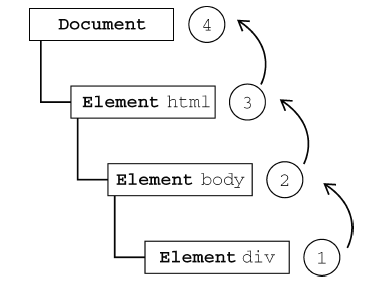
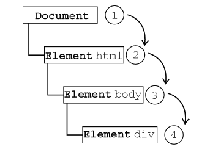

# JavaScript点击事件
## 场景
在最近的工作中，有2次接触到关于点击事件的问题，很快就想到了冒泡。脑海里有相关的内容，虽然解决了问题，但感觉就是说不清，也没有一个清晰的概念。翻阅了以前的笔记，发现信息不够，也该更新一下笔记内容了。
## 事件
JavaScript 与 HTML 之间的交互是通过事件实现的。事件，就是文档或浏览器窗口中发生的一些特定的交互。事件最早是在 IE3 和 Netscape Navigator 2 中出现的，当时是作为分担服务器运算负载的一种手段。在 IE4 和Navigator 4 发布时，这两种浏览器都提供了相似但不相同的API，这些API 并存经过了好几个主要版本。DOM2 级规范开始尝试以一种符合逻辑的方式来标准化DOM事件。IE9、Firefox、Opera、Safari 和Chrome 全都已经实现了“DOM2 级事件”模块的核心部分。IE8 是最后一个仍然使用其专有事件系统的主要浏览器。

## 事件流
事件流描述的是从页面中接收事件的顺序。当浏览器发展到第四代时（IE4 及Netscape Communicator 4），浏览器开发团队遇到了一个很有意思的问题：页面的哪一部分会拥有某个特定的事件？举个例子，点击一个元素时，那么算不算也点击了它的父元素。但 IE 和Netscape 开发团队居然提出了差不多是完全相反的事件流的概念。IE 的事件流是事件冒泡流，而 Netscape Communicator 的事件流是事件捕获流。

### 事件冒泡
IE 的事件流叫做事件冒泡（event bubbling），即事件开始时由最具体的元素（文档中嵌套层次最深的那个节点）接收，然后逐级向上传播到较为不具体的节点（文档）。单击一个 div 元素，下图为冒泡的过程。

所有现代浏览器都支持事件冒泡，但在具体实现上还是有一些差别。IE5.5 及更早版本中的事件冒泡会跳过 `<html>` 元素（从 `<body>` 直接跳到document）。IE9、Firefox、Chrome 和Safari 则将事件一直
冒泡到window 对象。

### 事件捕获
Netscape Communicator 团队提出的另一种事件流叫做事件捕获（event capturing）。事件捕获的思想是不太具体的节点应该更早接收到事件，而最具体的节点应该最后接收到事件。事件捕获的用意在于在事件到达预定目标之前捕获它。单击一个 div 元素，下图为捕获的过程。

## 点击事件封装js
### jquery.js
### tap.js
### Hammer.js
### fastclick.js

## 相关资料
- http://smashinghub.com/10-best-mobile-touch-javascript-framework.htm
- [JavaScript高级程序设计（第3版）](https://book.douban.com/subject/10546125/)
- [DOM](https://dom.spec.whatwg.org/)
- [DOM Events](https://dom.spec.whatwg.org/#introduction-to-dom-events)
- [Event](https://dom.spec.whatwg.org/#concept-event)