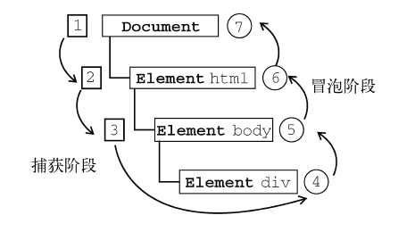

# JavaScript点击事件
## 场景
在最近的工作中，有2次接触到关于点击事件的问题，很快就想到了冒泡。脑海里有相关的内容，虽然解决了问题，但感觉就是说不清，也没有一个清晰的概念。翻阅了以前的笔记，发现信息不够，也该更新一下笔记内容了。
## 事件
JavaScript 与 HTML 之间的交互是通过事件实现的。事件，就是文档或浏览器窗口中发生的一些特定的交互。事件最早是在 IE3 和 Netscape Navigator 2 中出现的，当时是作为分担服务器运算负载的一种手段。在 IE4 和Navigator 4 发布时，这两种浏览器都提供了相似但不相同的API，这些API 并存经过了好几个主要版本。DOM2 级规范开始尝试以一种符合逻辑的方式来标准化DOM事件。IE9、Firefox、Opera、Safari 和Chrome 全都已经实现了“DOM2 级事件”模块的核心部分。IE8 是最后一个仍然使用其专有事件系统的主要浏览器。

## 事件流
事件流描述的是从页面中接收事件的顺序。当浏览器发展到第四代时（IE4 及Netscape Communicator 4），浏览器开发团队遇到了一个很有意思的问题：页面的哪一部分会拥有某个特定的事件？举个例子，点击一个元素时，那么算不算也点击了它的父元素。但 IE 和Netscape 开发团队居然提出了差不多是完全相反的事件流的概念。IE 的事件流是事件冒泡流，而 Netscape Communicator 的事件流是事件捕获流。

## 事件冒泡
IE 的事件流叫做事件冒泡（event bubbling），即事件开始时由最具体的元素（文档中嵌套层次最深的那个节点）接收，然后逐级向上传播到较为不具体的节点（文档）。单击一个 div 元素，下图为冒泡的过程。

所有现代浏览器都支持事件冒泡，但在具体实现上还是有一些差别。IE5.5 及更早版本中的事件冒泡会跳过 `<html>` 元素（从 `<body>` 直接跳到document）。IE9、Firefox、Chrome 和Safari 则将事件一直冒泡到window 对象。

## 事件捕获
Netscape Communicator 团队提出的另一种事件流叫做事件捕获（event capturing）。事件捕获的思想是不太具体的节点应该更早接收到事件，而最具体的节点应该最后接收到事件。事件捕获的用意在于在事件到达预定目标之前捕获它。单击一个 div 元素，下图为捕获的过程。

虽然事件捕获是Netscape Communicator 唯一支持的事件流模型，但IE9、Safari、Chrome、Opera 和 Firefox 目前也都支持这种事件流模型。尽管“DOM2 级事件”规范要求事件应该从 document 对象开始传播，但这些浏览器都是从window 对象开始捕获事件的。由于老版本的浏览器不支持，因此很少有人使用事件捕获。建议读者放心地使用事件冒泡，在有特殊需要时再使用事件捕获。

## DOM 事件流
“DOM2级事件”规定的事件流包括三个阶段：事件捕获阶段、处于目标阶段和事件冒泡阶段。首
先发生的是事件捕获，为截获事件提供了机会。然后是实际的目标接收到事件。最后一个阶段是冒泡阶段，可以在这个阶段对事件做出响应。单击一个 div 元素，下图为触发事件的过程。

即使“DOM2 级事件”规范明确要求捕获阶段不会涉及事件目标，但IE9、Safari、Chrome、Firefox 和Opera 9.5 及更高版本都会在捕获阶段触发事件对象上的事件。结果，就是有两个机会在目标对象上面操作事件。

现在问题来了：同一个元素，在冒泡和捕获阶段都绑定事件处理程序，会如何？

经过测试，发现绑定事件处理程序在前面的先触发。

## 点击事件封装js
### jquery.js
### tap.js
### Hammer.js
### fastclick.js

## 相关资料
- http://smashinghub.com/10-best-mobile-touch-javascript-framework.htm
- [JavaScript高级程序设计（第3版）](https://book.douban.com/subject/10546125/)
- [DOM](https://dom.spec.whatwg.org/)
- [DOM Events](https://dom.spec.whatwg.org/#introduction-to-dom-events)
- [Event](https://dom.spec.whatwg.org/#concept-event)
- https://developer.mozilla.org/en-US/docs/Web/API/EventTarget/addEventListener
- https://developer.mozilla.org/en-US/docs/Web/API/EventTarget/removeEventListener
- [过时的DOM活动表](https://www.w3.org/DOM/Activity)
- [DPM2 Events](https://www.w3.org/TR/DOM-Level-2-Events/)
- [Touch](https://developer.mozilla.org/en-US/docs/Web/API/Touch)