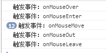
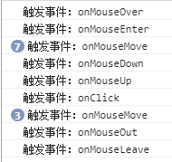
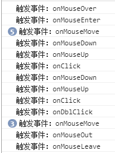

# Mouse Events & Touch Events
## 场景
在探索了 JavaScript 事件之后，紧接着就对移动端的点击事件进行进一步了解。由于点击延迟 300 毫秒，除了各厂商给出的解决方案，在程序方面也有对应的解决方案，于是选取了几种进行对比查看。在查看源码的过程中，发现了关于事件执行顺序的问题。觉得有必要对点击相关事件的执行顺序，进行一次更全面一些的探索。

## Mouse Events 和 Touch Events
### Mouse Events (鼠标事件)
常用的鼠标事件如下：
- click
- dblclick
- mousedown
- **mouseenter**
- **mouseleave**
- mousemove
- mouseover
- mouseout
- mouseup

对于这些有几点说明：
1. mouseenter 事件类似于 mouseover 事件。 唯一的区别是 mouseenter 事件不支持冒泡 。
2. mouseleave 事件类似于 mouseout 事件。 唯一的区别是 mouseleave 事件不支持冒泡。
3. 以上对应的 HTML 事件属性可用于所有 HTML 元素，除了以下标签
```html
<base>、<bdo>、<br>、<head>、<html>、<iframe>、<meta>、<param>、<script>、<style>、<title>
```

第3条之前一直没有注意过，但个人没有在规范里找到，只是找到了一个 [Note](https://www.w3.org/TR/2017/REC-html52-20171214/dom.html#global-attributes)：虽然这些属性都可以应用到所有的元素，但并不是所有的属性都会有效。于是就亲自验证一下最常见的 onclick 属性。这个[测试页面](https://xxholic.github.io/lab/lab-js/15/html-event-support.html)，手机端访问如下。


测试结果就是：html、base、bdo 标签支持 onclick 属性并有效。所以第 3 条的说法有问题，如果有使用需求，需要注意。

### Touch Events (触摸事件)
触摸事件如下：
- touchstart
- touchend
- touchmove
- touchcancel

在规范里面找到了一张图，很清晰的说明了一些特性，如下图。


## 事件触发顺序
以下的测试验证，是针对同一个元素的事件触发顺序。
### PC端
这是[测试页面](https://xxholic.github.io/lab/lab-js/15/event-order.html)。
#### 不点击的情况下
正常“移入 -> 离开”触发的顺序：

mouseover -> mouseenter -> mousemove -> mouseout -> mouseleave。



#### 点击的情况下
正常“移入 -> 单击 -> 离开”触发顺序：

mouseover -> mouseenter -> mousemove -> mousedown -> mouseup -> click -> mousemove -> mouseout -> mouseleave。



#### 双击的情况下
正常“移入 -> 双击 -> 离开”触发顺序：

mouseover -> mouseenter -> mousemove -> mousedown -> mouseup -> click -> mousedown -> mouseup -> click -> dblclick -> mousemove -> mouseout -> mouseleave。



### 手机端
手机端访问如下。


#### 正常单击的情况
如果上面所列的鼠标事件和触摸事件都绑定了，那么顺序就是这样的：

*IOS：*

touchstart -> touchend -> mouseover -> mouseenter -> mousemove。

IOS 里面 click 事件没有触发，网上那么多写的什么触发了 touchstart，事件流会继续下去，这是什么情况？在前面介绍触摸事件的时候，可以看到touchend后面对应的 Default Action 有 mousemove、 mousedown、 mouseup、click，猜测是只会按顺序触发其中的一种，不会都触发。做了下面的测试。

只绑定了 click、 dblclick 事件情况。


只绑定了 mousemove、click、dblclick 事件情况。


只绑定了 mousedown、click、dblclick 事件情况。


只绑定了 mouseup、click、dblclick 事件情况。


发现在 IOS 里面如果绑定了 mousemove 事件，click 事件就不会触发。不会触发 dblclick 事件。

*Android:*

touchstart -> touchend -> mouseover -> mouseenter -> mousemove -> mousedown -> mouseup -> click。

*共同点：*
- mouseover 第一次点击的时候会触发，紧接着继续点击第二次的时候就不会触发。当点了该元素之外的区域，再次点击的时候，又会触发。换个说法，就是类似再次“获取焦点”的时候就会触发该事件。
- 点击很快的时候，click 可能会连续重复执行，而不是每次从 touchstart 开始。

#### 快速多次点击的情况
*IOS：*

跟正常单击的情况一致。

*Android:*

touchstart -> touchend -> mouseover -> mouseenter -> mousemove -> mousedown -> mouseup -> click -> touchstart -> touchend ->  mousemove -> mousedown -> mouseup -> click -> dblclick。

## 最后说一些
大部分的情况还是比较容易理解。上面进行验证的是比较正常的情况，目前足够帮助自己进行其它的探索。一些相对不正常的情况，要同时绑定很多事件并触发，一般不会这么做。如果实际中有碰到，会再进行补充。

## 2018.08.29 关于 touchcancel 事件
之前一直没有注意到 touchcacenl 事件，直到看了别人写代码，发现 touchcancel 还是有用的，只是自己平时一般用不到。对于 touchcancel 的介绍，有下面的说明：
> 用户代理必须要触发这个事件类型，来表明在进行特定行为的时候，什么时候触摸被打断，例如一个同步的事件、或者一个来自用户代理的动作、或者触摸点离开了文档进入到一个没有文档的能够跟用户互动的区域。当用户在触摸表面上，放置比设备支持或者储存配置的触摸点更多的时候，用户代理可能会触发这个事件，在这种情况下，在触摸列表里面更早的 Touch 对象应该被移除。

> 当第一次触摸表面的时候，这个事件的目标一定要跟触摸开始的元素是同一个，即使触摸点已经移出到了目标元素交互区域之外。


> 被移除的触摸点一定是包含在 TouchEvent 触摸改变的属性里面，一定不包含触摸和目标触摸属性中。

会中断触摸的情况，比较容易理解的例子是手指滑动屏幕的时候，突然来了电话或者弹出了一个信息。在 PC 端开发调试 h5 页面的时候，如何让 touchcancel 事件触发？


## 参考资料
- [Global-attributes](https://www.w3.org/TR/2017/REC-html52-20171214/dom.html#global-attributes)
- [MDN Touch](https://developer.mozilla.org/en-US/docs/Web/API/Touch)
- [touch-interface](https://www.w3.org/TR/touch-events/#touch-interface)
- [dom events](https://dom.spec.whatwg.org/#introduction-to-dom-events)
- [touchcancel](https://www.w3.org/TR/touch-events/#dfn-touchcancel)