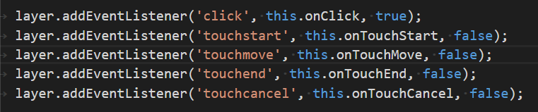

# 手机端点击事件
## 想法
现在是移动先行的时代，手机端的处理变得越来越重要。在事件方面，感觉点击是用的最多的，由于移动端点击事件的一些特殊性，对点击事件的封装也是有好几种，对此，想看看他们的封装到底有什么不一样。

## 点击的问题
很容易让人想到的是点击延迟的问题，详情见[移动端 Click 300 毫秒延迟的问题](https://github.com/XXHolic/segment/issues/8)，由于这个就会产生“点透”的现象，这么来说其实还是有些模糊，查询了网上关于这样的一些文章，发现这个“点透”现象，基本都是因为同一个点击效果，去绑定了不同类型的事件。例如一个元素绑定了click事件，另外一个原始绑定了touch事件，两个元素触发区域重合了，由于事件先后执行是有一定顺序，这样就“点透”了。这个是[click点透示例](https://xxholic.github.io/lab/lab-js/19/click-penetrate.html)。扫一扫访问如下。

想想这种现象的起因，感觉有些奇怪，这种点击效果在一个系统里面，为什么不用统一的点击事件，感觉从一开始是可以进行一定的预防。
## 点击封装几个插件
### fastclick
整体的实现思路：

在目标元素尽量外层的元素 A（建议是 body 元素）上，用 fastclick 进行初始化并对元素A注册相关事件处理程序。目标元素注册了click事件处理程序，在触发的时候，元素A中相关的事件会先触发，进行相关的判断处理后，会模拟一个目标元素的click事件并主动触发，这样子就减少了延迟。

下面进一步了解相关的实现。

初始化时，主要注册的事件有 click、touchstart、touchmove、touchend、touchcancel，其中 click 事件处理程序在捕获阶段注册，其余事件在冒泡阶段注册。

单击目标元素的时候，首先触发的是 A 元素的相关事件，主要顺序是touchstart->touchend->click。它们依次的主要作用是：
- touchstart：记录点击的位置和防止快速双击。
- touchend ：判断是否需要模拟事件并马上触发。
- click：判断点击是否有效。

A元素的事件触发完后，目标元素的click事件再触发。在这里产生了一个疑问：touch 事件比 click事件早触发，那在不同的阶段注册事件处理程序，那个会先执行？经过尝试后得到的结论见[JavaScript 事件](https://github.com/XXHolic/blog/issues/14)总结。

### hammer
### zepto
### jquery-mobile

## 相关资料
- [Touch](https://developer.mozilla.org/en-US/docs/Web/API/Touch)
- http://smashinghub.com/10-best-mobile-touch-javascript-framework.htm
- https://www.zhangxinxu.com/wordpress/2012/04/js-dom%E8%87%AA%E5%AE%9A%E4%B9%89%E4%BA%8B%E4%BB%B6/