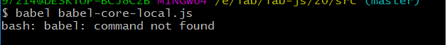
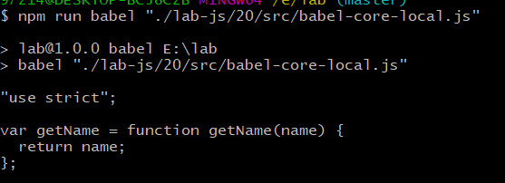

# Babel
## 想法
在一次分享中，有人提出要分享关于babel，本来自己打算了解这个方面，于是借着这个契机，先自己了解一下babel。

## Babel 是什么？
Babel 是一个 JavaScript 编译器，它主要用于将 ECMAScript 2015+ 版本的代码转换为适合新旧浏览器或者环境运行的代码。Babel 主要可以做的是：
- 语法转换
- 在目标环境中提供腻子脚本（通过[babel/polyfill][url-doc-babel-polyfill]）
- 源代码转换（codemods）
- 更多，可以查看官方[文档][url-babel-doc]

```javascript
// Babel Input: ES2015 arrow function
[1, 2, 3].map((n) => n + 1);

// Babel Output: ES5 equivalent
[1, 2, 3].map(function(n) {
  return n + 1;
});
```
关于编译器的运行机制，可以参考[the-super-tiny-compiler][url-the-super-tiny-compiler]，也从更高一个层面，解释了Babel自身如何运行。

## 本地 Babel 使用
[@babel/cli][url-docs-babel-cli]是可以让你在命令行下使用 Babel 编译文件的工具。

### 1 安装
建议依赖项目单独安装，而不是全局，这样方便不同版本 Babel 的管理，让项目也有更好的可移植性并且易于安装。
```shell
# npm
npm install --save-dev @babel/core @babel/cli

# or yarn
yarn add @babel/core @babel/cli --dev
```
### 2 创建 .babelrc 配置文件
Bable 在默认情况下是什么都不会做，需要明确的告诉 Bable 去做什么。这个时候就需要创建一个配置文件 .babelrc 告诉 Babel 该做什么。以常见配置转换 ES2015+ 为例。

安装 [babel-preset-env][url-docs-babel-preset-env]，这个是官方推荐的包，希望替代 babel-preset-es2015，相关详细介绍在[这里][url-why-use-babel-preset-env]。需要注意的是 Babel 版本是7及以上。
```shell
# npm
npm install --save-dev babel-preset-env
# or yarn
yarn add babel-preset-env --dev
```
成功后在配置文件 .babelrc 中进行配置：
```json
{
  "presets": ["env"],// 预设
}
```
### 3 本地执行命令
1. 用 babel 命令单文件处理方式
```shell
babel "demo.js"
```
会出现提示：



这个是由于 babel 是依赖项目本地安装，并不是全局安装。需要在 package.json 中配置相应脚本命令。
```json
  "scripts": {
    "babel": "babel",
  }
```
然后执行命令，要注意对应文件的路径。示例结果如下：



2. 用 npm 脚本批量处理的方式
类似的配置脚本命令，指定相应路径。
```json
  "scripts": {
    // 把 路径 src 下的文件转换后输出到 lib 文件夹下
    "local-babel": "babel src -d lib"
  },
```


## 构建工具 Babel 使用
根据文档中的描述，找到对应的[安装方式][url-babel-setup]。可以发现，基本上主流的构建工具都支持。个人选择的是 Webpack 工具。

### 1 安装
```shell
# npm
npm install --save-dev babel-loader babel-core
# or yarn
yarn add babel-loader babel-core --dev
```
babel-loader 和 babel-core 是干什么的呢？
[babel-loader][url-babel-loader]包允许使用 Babel 和 webpack 来转译 javascript 文件。webpack的 **loader** 能够让 webpack 处理那些非 JavaScript 文件，并且先将它们转换为有效模块，然后添加到依赖图中，这样就可以提供给应用程序使用。也就是说 babel-loader 是为了在 webpack 中使用babel的一个包。

[babel-core][url-babel-core-docs] 包可以让你以编程的方式来使用 Babel。例如：
```javascript
var babel = require("@babel/core");
babel.transform(code, options, function(err, result) {
  result; // => { code, map, ast }
});
```

### 2 配置
```javascript
module: {
  rules: [
    { test: /\.js$/, exclude: /node_modules/, loader: "babel-loader" }
  ]
}
```
安装了对应的包后，要告诉 webpack 编译器如何使用这些包，一般就要在配置文件webpack.config.js进行配置。上面loader的配置中字段还以分别是：
- test属性，用于标识出应该被对应的 loader进行转换的某个或某些文件。
- use属性，表示进行转换时，包含多个所需的 loader，如果只有一个，可以省去，使用loader属性，格式：laoder: XX。
- exclude属性，表示那些目录下的文件不需要处理。
详细的的说明见[webpack-configuration][url-webpack-configuration]。

上面的配置信息用另外一种方式表达：

> “嘿，webpack 编译器，当你碰到「在 require()/import 语句中被解析为 '.js' 的路径且不在 'node_modules' 路径下」时，在你对它打包之前，先使用 babel-loader 转换一下。”

### 3 创建 .babelrc 配置文件
Bable 在默认情况下是什么都不会做，需要明确的告诉 Bable 去做什么。这个时候就需要创建一个配置文件 .babelrc 告诉 Babel 该做什么。下面以配置转换 ES2015+ 为例。

安装 [babel-preset-env][url-docs-babel-preset-env]，它允许你是用最新的语法，而不用去考虑那种环境下该用什么语法。
```shell
# npm
npm install --save-dev @babel/preset-env

# or yarn
yarn add @babel/preset-env --dev
```
配置 .babelrc文件
```json
{
  "presets": ["env"],// 预设
}
```
安装好了后，建议配置需要兼容的目标环境。不配置时，默认进行设置规则见[browserslist][url-dcos-browserslist]。在 `package.json` 里面进行配置方式如下：
```json
{
  // 用户的浏览器市场份额>0.25%,还存在的浏览器，排除了不进行安全更新的浏览器，例如 IE 10 和 BlackBerry
  "browserslist": "> 0.25%, not dead"
}
```

## 在线使用 babel 功能


## 参考资料
- [github-babel][url-babel]
- [babel][url-babel-github-io]
- [babel-user-handbook][url-babel-user-handbook]
- [webpack][url-webpack]
- [JS - Babel使用详解1](url-blog1)

<!-- Babel 是什么？ -->
[url-babel-doc]:https://babeljs.io/docs/en
[url-doc-babel-polyfill]:https://babeljs.io/docs/en/babel-polyfill
[url-the-super-tiny-compiler]:https://github.com/jamiebuilds/the-super-tiny-compiler
[url-babel-loader]:https://github.com/babel/babel-loader

<!-- 本地 Babel 使用 -->
[url-docs-babel-cli]:https://babeljs.io/docs/en/babel-cli
[url-why-use-babel-preset-env]:https://babeljs.io/docs/en/env#before-you-do-anything

<!-- 构建工具 Babel 使用 -->
[url-babel-setup]:https://babeljs.io/setup.html
[url-babel-core-docs]:https://babeljs.io/docs/en/babel-core
[url-webpack-configuration]:https://webpack.js.org/configuration/
[url-docs-babel-preset-env]:https://babeljs.io/docs/en/babel-preset-env
[url-dcos-browserslist]:https://github.com/browserslist/browserslist#queries

<!-- 在线使用 babel 功能 -->
[url-docs-babel-standalone]:https://babeljs.io/docs/en/next/babel-standalone.html

<!-- 参考资料 -->
[url-babel]:https://github.com/babel/babel
[url-babel-github-io]:https://babeljs.io/
[url-babel-user-handbook]:https://github.com/jamiebuilds/babel-handbook/blob/master/translations/zh-Hans/user-handbook.md
[url-webpack]:https://webpack.js.org/concepts/
[url-blog1]:http://www.hangge.com/blog/cache/detail_1688.html

