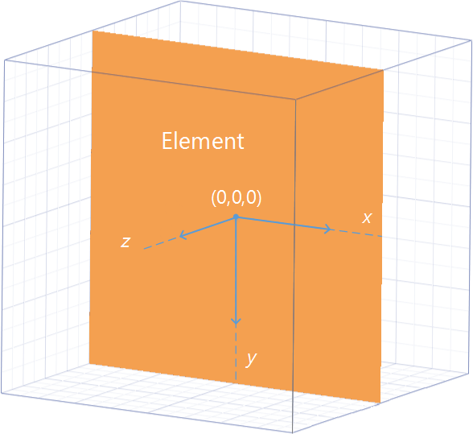
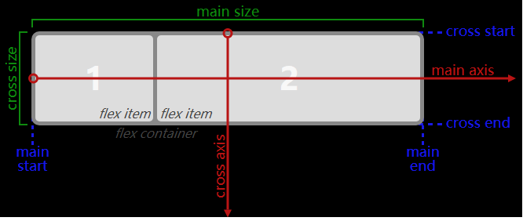

# CSS居中初级理解
## 目录
- [想法](#mind)
- [约定](#appoint)
- [居中](#center)
  - [水平居中](#horizontal)
  - [垂直居中](#vertical)
- [参考资料](#reference)
## <a name="mind"></a> 想法
在工作刚开始的时候，对CSS还是很有热情的，也花了时间看了些相关的书籍，做了相关的尝试。随着工作经验积累，手上的事情也越来越多，大部分时候根据已有的经验快速解决问题。时间久了，知道怎么写出这个效果，但写的时候往往很少再去想一下，这个属性的具体作用。所以在此对经常使用的CSS属性“再想一下”。
## <a name="appoint"></a> 约定
“再想一下”更多的是去理解规范，在这里就不会去比较它们的优劣和兼容性，如果理解了这些，我想到时候自然知道如何去选择。CSS居中在设计和代码实现中用的很多，居中效果需要有一个参照物，下面CSS实现方法前提是，都有一个一定高度和宽度的父元素。
以下方法示例页面，可以进行对照：https://xxholic.github.io/lab/lab-css/css-center.html

手机端浏览


## <a name="center"></a> 居中
经常遇到的居中效果主要有2种：水平居中和垂直居中。需要居中的元素高宽度可能有或没有，为了方便理解，先以有固定高宽度元素为例。html的结构如下：
```html
<div class="css-center-parent">
  <div class="css-center-rec"></div>
</div>
```
基本的属性如下：
```css
.css-center-parent {
  border: 1px solid #333;
  width: 300px;
  height: 186px;
}
.css-center-rec {
  border: 1px solid #333;
  width: 100px;
  height: 62px;
}
```
## <a name="horizontal"></a> 水平居中
#### 方法1：使用margin
```css
.ma {
  margin: 0 auto;
}
```
margin是一个简写属性，上面的意思就是margin-top和margin-bottom值为0，margin-left和margin-right值为auto，可为什么左右值为auto就可以水平居中了？找文档，文档里面对取值为auto单独的有一个说明链接[calculating widths and margins](https://www.w3.org/TR/CSS22/visudet.html#Computing_widths_and_margins)，过去之后发现计算margin的值是跟其它的属性也有关系，按情况分有10种情况，这个例子是属于第3种情况：在正常文档流中的块级非替换元素。
> 3. block-level, non-replaced elements in normal flow

相互影响的属性是有下面一个强制约定的关系：
> 'margin-left' + 'border-left-width' + 'padding-left' + 'width' + 'padding-right' + 'border-right-width' + 'margin-right' = width of containing block

下面说了好几种更详情的情况，这个例属于最后说明：如果margin-left和margin-right值都是auto，那么它们渲染出来的值就相等。所以这样使用margin就让元素水平居中了。

#### 方法2：改变居中元素display属性,父元素设置text-align: center;
```css
/* 添加到父元素上 */
.tc {
  text-align: center;
}
/* 添加到居中元素上 */
.dib {
display: inline-block;
}
```
在一些教程里面对text-align的解释是：指定元素文本的水平对齐方式。但这里是一个元素又不是文本，为什么就居中了？找文档走起，看了之后发现，这个感觉就是英文单词上的误导。这个属性描述的是块级元素里面内联级别内容如何对齐，并不是只针对文本。
> This property describes how inline-level content of a block container is aligned.

元素设置了display: inline-block后也有了内联元素的特性，text-align也就生效了，所以就让元素水平居中了。

#### 方法3：使用定位position和margin负值
```css
/* 添加到父元素上 */
.pr {
  position: relative;
}
/* 添加到居中元素上 */
.css-center-rec-pos-justify1 {
  position: absolute;
  left: 50%;
  margin-left: -50px;
}
```
这个主要是要理解属性的具体作用。找文档，首先，margin是可以为负值，不过可以有一些特定于具体实现的限制。
> Negative values for margin properties are allowed, but there may be implementation-specific limits.

设置margin为负值，效果就是超过了父元素的边框，这里居中元素会向左超出50px。然后设置了居中元素position绝对定位（不一定要绝对定位）。left属性含义是：该元素的左外边距边界相对于其包含块左边界有多远。值为百分比时，计算相对于其包含块的宽度计算。这里用了绝对定位，包含块左边界为包含块的内边距左边界。
由于box-sizing的属性值为border-box，该元素的边框和内边距都会在设置的width值内绘制，所以实际上，计算left百分比偏移的宽度值为300px-2px=298px，这里居中元素向右偏移了298px * 50% = 149px。最终距离父元素左边界149px-50px=99px，父元素width值为300px,居中元素width值为100px，居中元素离右边界距离：300px-2px-100px-99px=99px,该元素就水平居中了。

#### 方法4：使用定位position和transform
```css
/* 添加到父元素上 */
.pr {
  position: relative;
}
/* 添加到居中元素上 */
.css-center-rec-pos-justify1 {
  position: absolute;
  left: 50%;
  transform: translateX(-50%);
}
```
这个主要是要理解属性的具体作用。position定位在方法3中提过，至于transform这个属性,找文档。虽然还没有正式成为标准，但大部分浏览器都已经支持了，transform属性会让这个元素建立自己的坐标系，在坐标系里面可以改变形状，大小和位置。这只是视觉上的变化，实际的位置并没有变。



元素坐标系的原点默认是元素的中心，translateX就是元素中心沿着坐标系X轴移动，值为百分数的时候，计算值是相对于元素自身的宽度。与方法3中解释那样，position定位向右偏移了298px*50%=149px，元素自身transform向左偏移了100px * 50%=50px，最终距离父元素左边界149px-50px=99px，父元素宽度300px,居中元素宽度100px，视觉上居中元素离右边界距离：300px-2px-100px-99px=99px，该元素就水平居中了。更多相关点击[这里](https://www.w3.org/TR/css-transforms-1/)。

#### 方法5：使用flex layout
```css
/* 添加到父元素上 */
.df {
  display: flex;
}
.css-center-parent-flex-justify {
  justify-content: center;
}
```
这个主要也是理解属性的具体作用。在CSS2.1中定义了4种布局模式：block layout、inline layout、table layout、positioned layout。这种方法使用的是新的一种布局模型:flex layout,它是为复杂的应用程序和网页设计。flex布局模式主要由父容器和它直接的子元素组成，父容器被称为flex容器（flex container），其直接子元素被称为flex项（flex items）。
代码中父元素设置display:flex，让它成为了flex容器，其直接子元素的排列就使用flex布局模式。在CSS中定义了一些跟物理方向和空间相对应的一些概念，这些概念为未来定义新的布局提供理论的支持，在flex布局模式中对应物理方向和空间的概念如下图。



- main axis:主轴，flex items的排列是按照主轴进行排列，主轴的方向取决于flex-direction属性，不一定是水平方向。
- main-start/main-end:flex容器主轴上的开始/结束位置，flex项的排列是从main-start开始，到main-end结束。
- main-size:在主轴方向flex容器或者flex项的高度或宽度，它可能是元素的宽度或高度属性的值。
- cross axis:侧轴，跟主轴方向垂直的轴。
- cross-start/cross-end:flex容器侧轴上的开始/结束位置，flex项的排列是从cross-start开始，到cross-end结束。
- cross-size:在侧轴方向flex容器或者flex项的高度或宽度，它可能是元素的宽度或高度属性的值。

flex-direction默认值是row，表示主轴为水平方向，起点在左端。父元素设置justify-content属性表示的是该容器下的flex项在主轴上的对齐方式，其属性值center表示在main axis上居中对齐，其直接子元素就水平居中了。更多相关点击[这里](https://www.w3.org/TR/css-flexbox-1/)。
## <a name="vertical"></a> 垂直居中
#### 方法1：使用vertical-align
```css
/* 添加到父元素上 */
.css-center-parent-before:before {
  content: '';
  display: inline-block;
  height: 100%;
  vertical-align: middle;
}
.css-center-parent-before {
  font-size: 0;
}
/* 添加到居中元素上 */
.dib {
  display: inline-block;
}
.vam {
  vertical-align: middle;
}
```
CSS盒子在正常文档流中格式化可能是块级或内联，但不可能同时块级和内联。块级盒子会进行块级格式化上下文，行内盒子进行内联格式化上下文。vertical-align属性定义行内元素的基线相对于该元素所在行框（line box）的基线的垂直对齐，只作用于行内元素（inline-level）和表格单元（table-cell） 元素，vertical-align的默认值是baseline，就是说这个元素的基线跟行框的基线对齐。行框简单来说就是包含所有盒子的一个矩形区域形成的一行。行框的高度由内容形成。
> The rectangular area that contains the boxes that form a line is called a line box.

现在的情况是居中元素本来是块级的，所以首先要让其具有行内元素特性，设置了样式display:inline-block。其父容器并非是居中元素的line-box,所以设置了vertical-align: middle也不会生效，因此利用伪元素生成一个跟居中元素位于同意行框的元素，使其具有行内元素特性，高度设置为跟父容器相同，这样子vertical-align: middle就会生效，属性值middle的意思是盒子的中点与行框基线上方0.5ex处的一个点对齐。关于这个0.5ex的定义与字体和用户代理实现相关，根据现在浏览器中的表现，就是垂直居中了。
关于为什么父元素要设置font-size:0，这个是由于行内块之间会产生一些间隙，具体的原因点击[这里](http://www.iyunlu.com/view/css-xhtml/64.html)。
#### 方法2：使用定位position和margin负值
```css
/* 添加到父元素上 */
.pr {
  position: relative;
}
/* 添加到居中元素上 */
.css-center-rec-pos-align1 {
  position: absolute;
  top: 50%;
  margin-top: -31px;
}
```
这个跟水平居中的方法3类似，只是对应使用的属性不一样。设置margin-top为负值，居中元素会向顶部超出31px。然后设置了居中元素position绝对定位（不一定要绝对定位）。top属性含义是：该元素的上外边距边界相对于其包含块上边界有多远。值为百分比时，计算相对于其包含块的高度计算。这里用了绝对定位，包含块上边界为包含块的内边距上边界。

 由于box-sizing的属性值为border-box，该元素的边框和内边距都会在设置的width值内绘制，所以实际上，计算top百分比偏移的高度值为186px-2px=184px,居中元素向下偏移了184px*50%=92px。最终距离父元素左边界92-31=61px，父元素高度186px,居中元素高度62px，居中元素离底部的距离为：186px-2px-62px-61px = 61px，该元素就垂直居中了。
#### 方法3：使用定位position和transform
```css
/* 添加到父元素上 */
.pr {
  position: relative;
}
/* 添加到居中元素上 */
.css-center-rec-pos-align2 {
  position: absolute;
  top: 50%;
  transform: translateY(-50%);
}
```
这个跟水平居中的方法4类似，只是对应使用的属性不一样。translate就是元素中心沿着坐标系轴移动，值为百分数的时候，计算值是相对于元素自身的高度。这里居中元素向上偏移了62 * 50% = 31px，跟方法2中解释类似，定位向下偏移了184 * 50% = 92px，最终居中元素距离父元素偏移的距离是92-31 = 61px，父元素高度186px,居中元素高度62px，居中元素离底部的距离为：186px-2px-62px-61px = 61px，该元素就垂直居中了。
#### 方法4：使用flex layout
```css
/* 添加到父元素上 */
.df {
  display: flex;
}
.css-center-parent-flex-justify {
  align-items: center;
}
```
这个跟水平居中的方法5类似，换成使用align-items属性，该属性含义是该容器下的flex项在侧轴 上的对齐方式，属性值center作用就是让flex items的外边距盒子在侧轴方向居中对齐。

以上方法示例链接：https://xxholic.github.io/lab/lab-css/css-center.html

## <a name="reference"></a> 参考资料
- Alignment: the 'text-align' property：https://www.w3.org/TR/CSS2/text.html#propdef-text-align
- Box dimensions：https://www.w3.org/TR/CSS2/box.html#box-margin-area
- Box offsets: 'top', 'right', 'bottom', 'left'：https://www.w3.org/TR/CSS2/visuren.html#propdef-left
- CSS Transforms Module Level 1：https://www.w3.org/TR/css-transforms-1/
- Containing blocks（包含块）：https://www.w3.org/TR/CSS2/visuren.html#containing-block
- Bring your page to life with CSS transforms：https://msdn.microsoft.com/en-us/library/jj665791(v=vs.85).aspx
- vertical-align：https://www.w3.org/TR/CSS2/visudet.html#propdef-vertical-align
- CSS Flexible Box Layout Module Level 1：https://www.w3.org/TR/css-flexbox-1/
- Abstract Box Terminology：https://www.w3.org/TR/css-writing-modes-3/#abstract-box
- Flex 布局教程：语法篇：http://www.ruanyifeng.com/blog/2015/07/flex-grammar.html
- Visual formatting model：https://www.w3.org/TR/CSS21/visuren.html#inline-formatting
- Centering in the Unknown ：https://css-tricks.com/centering-in-the-unknown/


