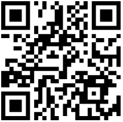
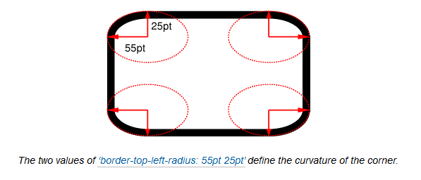
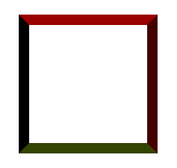
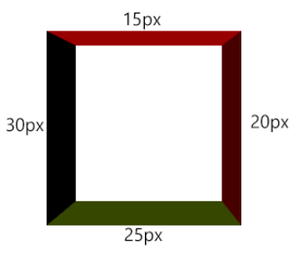

# CSS形状初级理解
## 目录
- [想法](#mind)
- [约定](#appoint)
- [形状](#shape)
  - [正方形](#square)
  - [长方形](#rectangle)
  - [正圆](#circle)
  - [椭圆](#oval)
  - [三角形](#triangle)
- [小结](#summarize)
- [参考资料](#reference)
## <a name="mind"></a> 想法
在工作的时候，会听到一些说法，比如“这个很简单，网上直接搜，然后复制粘贴一下”、“网上有直接可以拿来用的，何必自己费力去写”，现在想想就是这样的原因，导致一些最初本来理解的东西，不经思考粘贴复制久了，都慢慢淡忘了。在用CSS的过程中体会尤为明显，印象最深的是用CSS想写一些形状的时候，都要先网上搜一下,我感到不爽很久了，现在才决定花时间重新整理一下，惭愧惭愧。
## <a name="appoint"></a> 约定
以下形状都是只用一个html标签，未考虑兼容性，建议在Google Chrome浏览器中浏览。使用html标签结构如下：
```html
<div></div>
```
样式重置中使用了box-sizing:border-box，这个对一些形状实现有影响。

以下方法示例页面：[CSS形状初级理解示例](https://xxholic.github.io/lab/lab-css/css-shape.html)

手机端浏览


## <a name="shape"></a> 形状
### <a name="square"></a> 正方形
```css
.example-square {
  width: 100px;
  height: 100px;
  background-color: #333;
}
```
这种宽度和高度相等就可以了。
### <a name="rectangle"></a> 长方形
```css
.example-rectangle {
  width: 200px;
  height: 100px;
  background-color: #333;
}
```
这种宽度和高度不相等就可以了。
### <a name="circle"></a> 正圆
```css
.example-circle {
  width: 100px;
  height: 100px;
  border-radius: 50%;
  background-color: #333;
}
```
这个是使用了圆形边角属性：border-radius，是border-top-left-radius、border-top-right-radius、border-bottom-right-radius、border-bottom-left-radius缩写形式，它的作用是对元素的border box进行切圆角处理，如下图：



**值的形式**
\<length-percentage\>{1,2}
第一个值是切圆水平半径，第二个值是垂直半径，如果第二个值省略，将会复制使用第一个值。
**值的类型**
其值可以为绝对值或百分比，初始值为0，百分比时,第一个值参考的是元素border box的宽度（width），第二个值参考的是元素border box的宽度（height）,不能为负值。
**缩写取值规则**
缩写形式的取值跟border的规则类似，具体可参考[这里](https://developer.mozilla.org/en-US/docs/Web/CSS/border-radius)。
在示例中border-radius:50%的含义是这个元素的四个边角的切圆半径为100 * 50% = 50px,就是正圆的1/4，剩下的正好形成了一个正圆。
### <a name="oval"></a> 椭圆
```css
.example-oval {
  width: 200px;
  height: 100px;
  background-color: #333;
  border-radius: 100px/50px;
}
```
这个也是使用了border-radius，原理见正圆解释。border-radius:100px/50px缩写形式相当于：
```css
{
  border-top-left-radius:     100px 50px;
  border-top-right-radius:    100px 50px;
  border-bottom-right-radius: 100px 50px;
  border-bottom-left-radius:  100px 50px;
}

```
### <a name="triangle"></a> 三角形
1. 上三角
```css
.example-triangle-up {
  width: 100px;
  height: 100px;
  border-left: 50px solid transparent;
  border-right: 50px solid transparent;
  border-bottom: 100px solid #333;
}
```
很明显是利用了border属性，这个就有意思了，首先明确一个问题：相邻border交汇处是什么样子的？个人平常基本没有遇到相邻边不同颜色的情况，突然回想起来也是感到疑惑，就直接试一试，效果如下图：



原来border看起来是个梯形，相邻边交汇的地方好像被平分了，那再试试不相同width边看看效果，如下图：



边框交汇的并不是平分的，在相关的文档中也没有找到相关的说明，但交汇处的边界的终点，向相邻边作垂线，可以发现，是符合勾股定理的，因此交汇边界的方向是可以确定的。
再来看看上三角的示例，使用了左、底、右边框，左侧的width是50px，底部width值是100px，那么左侧和底部交汇边界的终点，就是垂直距离左边框边界50px和距离底边框边界100px的一个点，刚好是元素顶部边界的中点位置。左边框颜色透明，顶部边框有颜色，看起来好像截掉了一个直角三角形。右侧同理，截掉一个相同大小的直角三角形，上三角就形成了。
1. 下三角
```css
.example-triangle-down {
  width: 100px;
  height: 100px;
  border-left: 50px solid transparent;
  border-right: 50px solid transparent;
  border-top: 100px solid #333;
}
```
与上三角实现类似。
3. 右三角
```css
.example-triangle-right {
  width: 100px;
  height: 100px;
  border-top: 50px solid transparent;
  border-bottom: 50px solid transparent;
  border-left: 100px solid #333;
}
```
与上三角实现类似。
4. 左三角
```css
.example-triangle-left {
  width: 100px;
  height: 100px;
  border-top: 50px solid transparent;
  border-bottom: 50px solid transparent;
  border-right: 100px solid #333;
}
```
与上三角实现类似。

以上方法示例页面：[CSS形状初级理解示例](https://xxholic.github.io/lab/lab-css/css-shape.html)

## <a name="summarize"></a> 小结
以上是基本形状的实现方式初解，弄懂这些其实还是蛮简单，如果平时遇到的时候，自己稍微思考下而不是复制粘贴，不仅可以巩固一下相关的知识，而且还可能激发一些新的有趣想法。利用这些基本实现思路，可以写出很多其它的形状，例如六角星、五角星、钻石形状、爱心形状等。有空的时候再整理一下，感觉还是蛮有意思的。

## <a name="reference"></a> 参考资料
- https://developer.mozilla.org/zh-CN/docs/Web/CSS/border-radius
- https://drafts.csswg.org/css-backgrounds-3/#border-radius
- https://www.zhihu.com/question/35180018
- https://css-tricks.com/examples/ShapesOfCSS/

