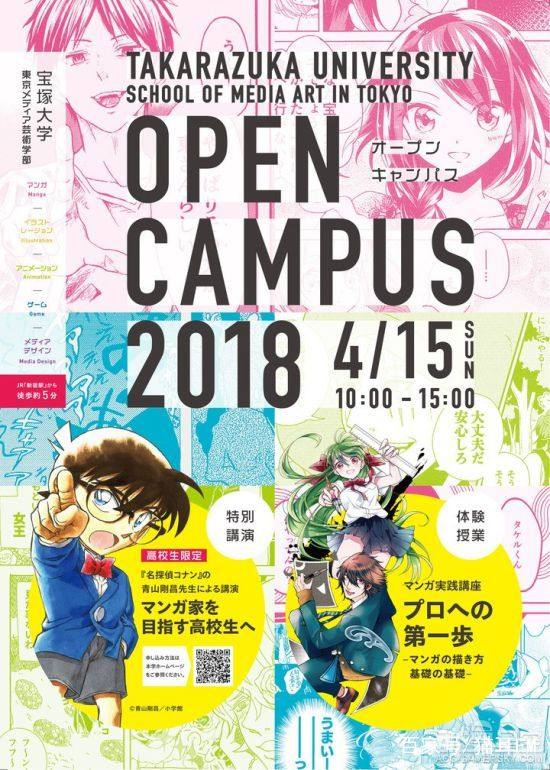

# “真想只有一个”台词由来
## 背景
最近在逛动漫资讯的时候，突然发现了《名侦探柯南》漫画作者青山刚昌的一篇演讲互动文章。想起在2017年12月份的时候，《名侦探柯南》宣布将长期休刊，难道是修养的时候，顺便到处聊聊梦想？

于是到网上查了下，发现在2018年4月1日，青山刚昌在4月1日愚人节发布了《柯南》漫画复刊的亲笔信。然后日本电视台对青山老师进行了上门采访。他表示自己“并不是卧病在床，而是由于一直努力工作没考虑年龄问题，于是编辑和我说休息也是工作的一环”，就这样开始休刊了。

在2018年4月15日于宝塚大学发表特别演讲“致梦想成为漫画家的高中生们”，下面是宣传海报。

## 部分交流记录
提问：小兰头上的角是怎么回事？
青山：很多人都提过这件事（笑），突然就变成那样了（笑）。我觉得可以理解为记号性质的轮廓吧。我父亲好像以为小兰一直戴着帽子（笑）。

提问：新一和小兰已经开始约会了，今后会有像亲密情侣之间的互动？
青山：会有的哦（笑）。明年的电影大概会有吧（笑）。

提问：柯南一个案子通常是3话一个系列，话数是不是提前决定好的？
青山：大致有个概念：“这个故事是3话”。但是像修学旅行那样的长篇一般都是5话或者6话，这种情况一般都是“连续杀人”（笑）。

提问：做漫画家有什么好处？
青山：能赚很多钱（笑），还有很多好吃的东西吃（笑），但是睡眠时间会很少，不过现在能睡得很饱（笑）。

提问：黑衣组织的代号是如何确定的？
青山：琴酒是助手提出的，（助手）说“这家伙有琴酒的感觉”，我说“是吗？”（笑）。贝尔摩得也是，（助手）跟我说“叫做贝尔摩得吧”（笑）。常常听助手的建议，感觉蛮合适的（笑）。

提问：青山老师您的座右铭是“不要杀死犯人，而要让他们活着赎罪”。但是“月光”事件中犯人却自杀了，为什么这么描写？
青山：我不知道偶尔这样安排一下好不好（笑）。我是想让并不完美的柯南对服部说“因为我杀过一个人”这句台词，才安排了这个犯人作为牺牲者（笑）。

提问：每部电影中，总是有青山先生画的原画，画哪个场景是由青山老师您决定的么？
青山：是的！我会在立川导演的分镜图上画个圈，写上“这里由我来画”！（笑）大概由我决定台词的地方会由我来画！（笑）
