# 但丁的地狱之旅
最近发现了一部动画电影《但丁的地狱之旅》，它是基于但丁作品《神曲》改变而成。主要讲主角但丁救自己的爱人进入地狱，在这个过程中也进行自我救赎。个人比较感兴趣的是对地狱的展现，其完整程度还是头一次见。那么就来看看但丁是如何到地狱一游的。

男主但丁跟爱人贝雅特丽丝发誓不会背叛，之后顺利啪啪啪。之后出去打仗。回来后发现家人及爱人遭人杀害，但爱人还有一口气，在她临死的时候欺骗她，说自己没有背板她。正当贝雅特丽丝以为自己可以安心去天堂时，路西法出现，说但丁违背了誓言，要把她的灵魂带走。于是但丁一路穷追不舍，路西法打开了地狱之门，进入之后及时关闭。但丁拼死来到地狱门前，但无法用手打开，由于自己的背叛，收到“触手”缝纫的惩罚。

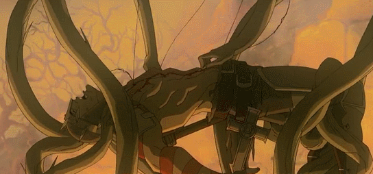

这个时候诗人之魂维吉尔出现，提示他信上帝，出奇迹，于是但丁对着十字架祈祷一下，然后再用力，地狱之门就掰开了。很重的一步：进入地狱，顺利完成。

进入地狱后，通过维吉尔的引导，要通过摆渡人Charon进入到地狱的第一层。运送亡魂，大多数印象是要一个人撑着一艘船，这里有意思的一点是，由于亡者越来越多，船的体量越来越大，变换成了人船合一的样子，整体样式如下：

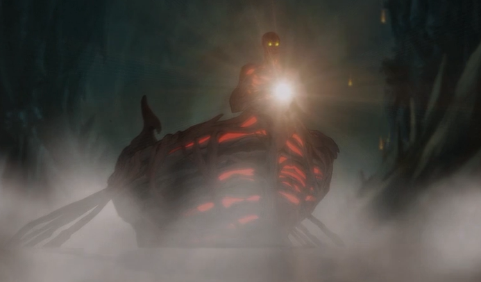

船头样子是这样子的：

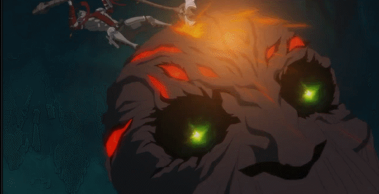

由于摆渡人不配合，但丁就干掉了摆渡人，然后通过维吉尔指引，来到了地狱边境。

## Limbo(地狱边境)
这里待着的人是一些异教徒和未经洗礼的孩子，动画表现出来是这样的：

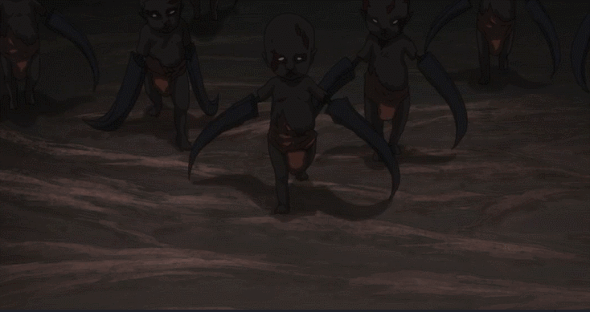

数量众多攻击力也不弱，但丁转身就跑，还好有维吉尔指引，顺利来到了第一个审判的地方，审判官的形象是这样子的：

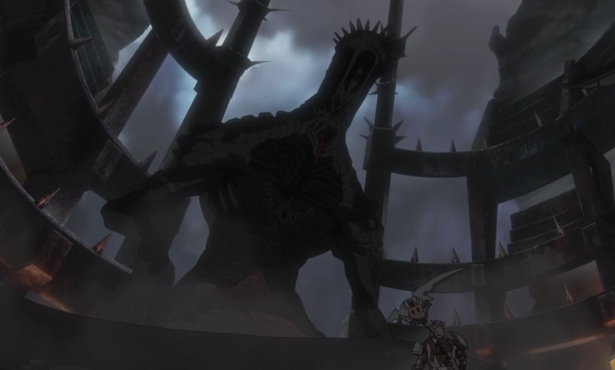

工作的任务就是审判后转到下一层地狱，审判的刑具类似齿轮。

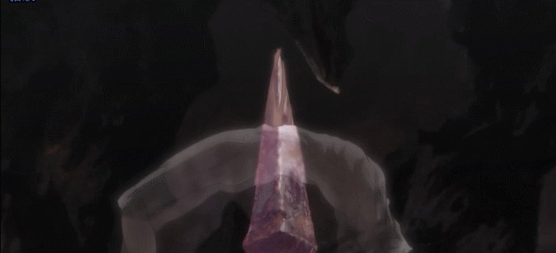

判官不让通过，就被但丁干掉了，进入第二层地狱。
## LUST(淫欲地狱)
犯了这种罪的人，会一直在淫欲的风暴中，是真的风暴那种。还举了几个例子，例如下面的两位是埃及的国王和王后。

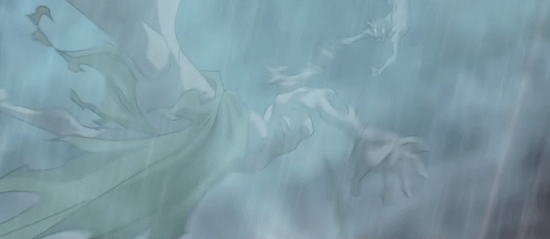

守卫是诱惑人犯罪的一些美女，如果自己不主动的话，别人就“主动”了。

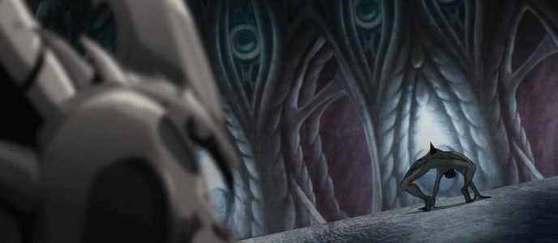

但丁救人心切，明显没有亲热的心情，就把这些美女都干掉了。但丁在这层承认了自己的罪过，然后继续进入到了第三层地狱。

## GLUTTONY(暴食地狱)
这里面是一些对生活总不满意，暴饮暴食的人。守卫是三头怪兽。

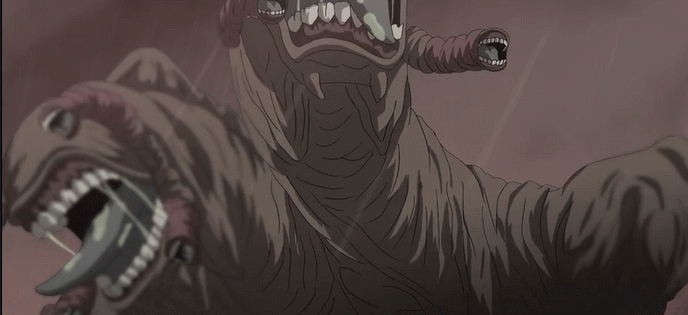

但丁给这怪兽心脏一击后，掉落到第四层地狱。

## GREED(贪婪地狱)

这里是对贪婪财富一类人的惩罚，这里主要是使用了自动化的机械，像一个机械城。

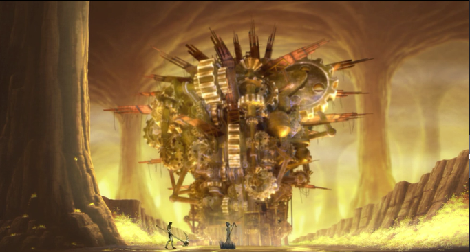

路西法派来但丁失去父亲的亡灵，承诺杀了但丁就放了他，并给他用不尽的财富。本来关系就不好的父子两就打起来了，但丁打败父亲后，级进入到了第五层地狱。

## ANGER(愤怒地狱)
在这里，罪人将被放进冥河之中挣扎。

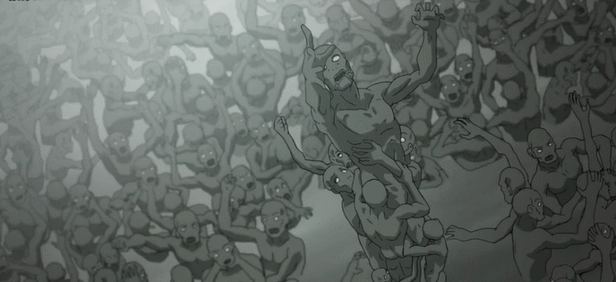

这一层有惊无险的就过去了，到了狄斯城，这个时候路西法正在宣布要结婚了，但丁听了很生气，想给路西法正面冲突，但路西法放了一个波就走了。但丁跟着追过去，进入了第六层地狱。

## The tombs of heresy(异教徒的坟墓)
无数的异教徒在这里被永恒之火燃烧，地狱景象是这样的：

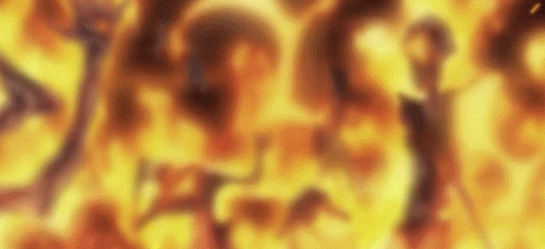

又碰到了一个但丁的老熟人，寒暄几句后，但丁干掉了他，就继续前进，进入到第七层地狱。

## VIOLENCE(暴力地狱)
这一层都是暴民，对他人施暴人，将永远浸泡在被害者沸腾的血液中受尽煎熬。

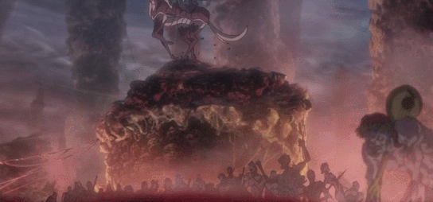

对自己施暴的人有同样会在这个地狱，这样的人会像树苗一样抽枝发芽，没有躯体，只有痛苦。

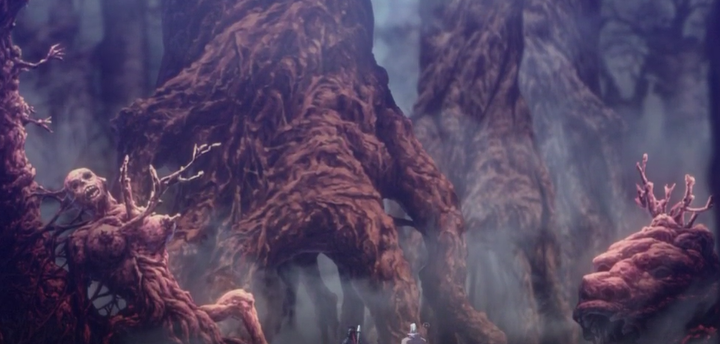

在这里发现了自己母亲死亡的真正原因，解救了母亲的灵魂。然后继续走，遇到了跟自己一起征战的十字军，原本以为是圣战，已经得到了主教的救赎，没想到都是骗人的。曾经的伙伴不能忍就他们呆在这里 ，跟但丁打了起来。最后但丁打败了他们，暂时消停了，继续前进，进入到第八层地狱。

## FRAUD(欺诈地狱)
这里关押的是骗取他人信任的人。

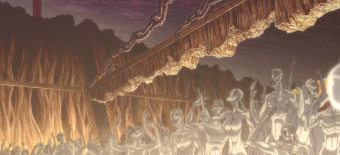

在地狱的尽头，路西法正在跟贝雅特丽丝举行婚礼。但丁急忙冲过去，在途中，但丁得知了贝雅特丽丝被杀的原因，原来是打仗期间，跟自己睡过的女人的丈夫，对他进行报复。贝雅特丽丝得知真相后，甘愿做路西法的新娘。变化的过程也是一个亮点。

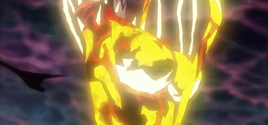

变身后，能力大增，各种虐但丁，在最后时刻，但丁拿出了贝雅特丽丝给他的家传十字架，贝雅特丽丝看到后，一下子就摆脱了恶魔装，并原谅了但丁，灵魂也被带上了天。早点拿出来不就可以了，何苦。救了自己爱人后，被告知想要离开，就要进入了第九层地狱。

## TREACHERY(背叛地狱)
背叛者的灵魂都被冰封在这里。

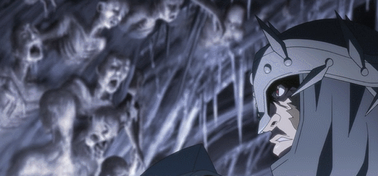

根据背叛者提供的信息，最终找到了路西法，进行了一场恶斗，最终无法力敌路西法，就借用上帝的力量封印了路西法。最后进入了炼狱。电影至此结束，然而故事似乎并没有结束。

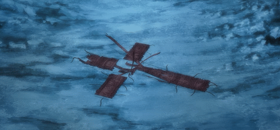
