# Genius Party
最近感觉时间很有限，看不了长篇的动漫，于是就找了一些短篇来看，发现了一个很有意思的作品：《Genius Party》。这个虽然说是动画电影，其内容是有几个短篇组成，每次看一个片段也不会有很大影响。关键是制作这些短篇的都是当时的大佬。

下面就来看看其中一个大佬表达的一些东西。

一开始一只奔跑的大鸟出现在视野中。

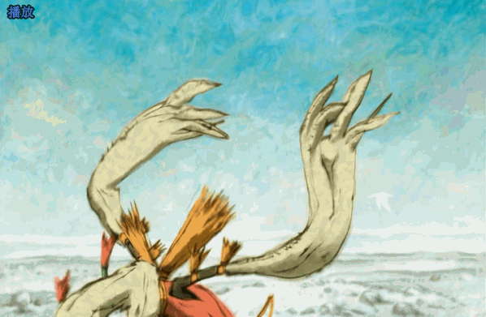

四周看了看后，继续以独有的姿态奔跑着。

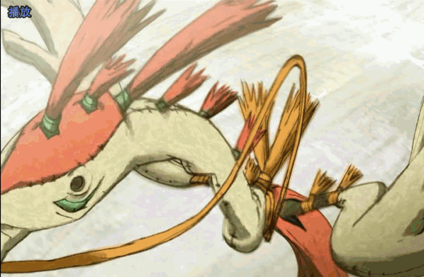

大鸟来到一个区域，附近地上有一些球状的生物在动。

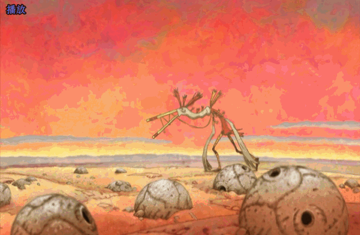

觉察到大鸟后，瞬间大惊，迅速遁入地下。

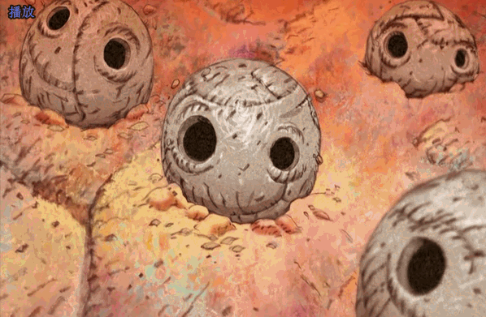

这种生物暂且称为圆球。

意外的是，附近有一个在专心欣赏的圆球，并没有注意到大鸟，而是与一株植物产生了感应，“爱心”不断触电。

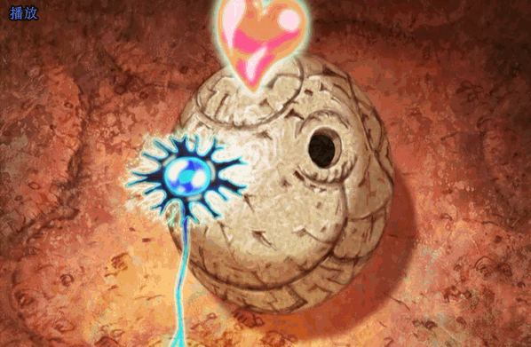

大鸟发现后，偷偷靠近。圆球觉察到后，想遁入地下，但为时已晚。

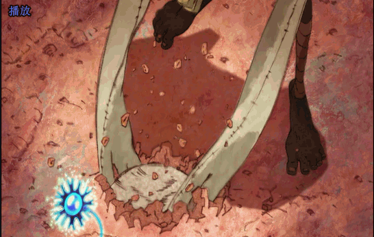

此时植物离开地表，圆球双眼发亮，“爱心”不禁为之雀跃而出，大鸟抓住时机，将圆球的“爱心”吃掉。

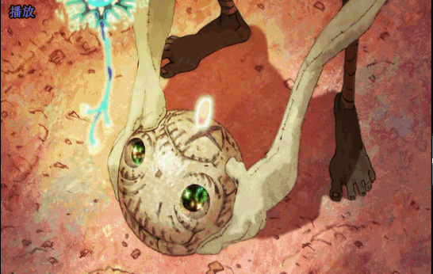

神奇的事情发生了，大鸟的翅膀生成了光一样的羽翼，可以飞行了！

大鸟在空中翱翔的时候，一株植物从天而降，大鸟发现后，一口吃掉了植物，并与其融为一体，变成了一个光球。

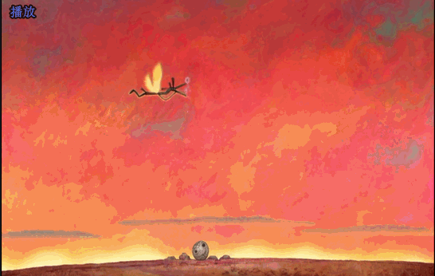

光球悬浮在空中，并不停的抖动着，在空中无规则移动后就离开了。

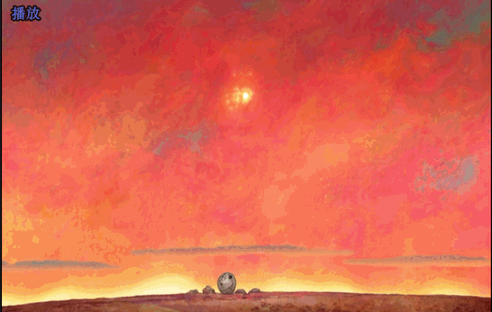

失去“爱心”的圆球，眼神空洞，一动不动，仿佛失去了生命一样。不知道过了多久，天上乌云弥补，一滴金色液体，落入到圆球脑洞里面，圆球仿佛被电机般，想起了曾经的激情时刻，突然产生了一颗新的“爱心”。

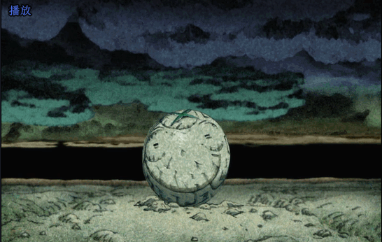

但没有持续多长时间，“爱心”就石化碎掉了，再次尝试也是同样的结果。

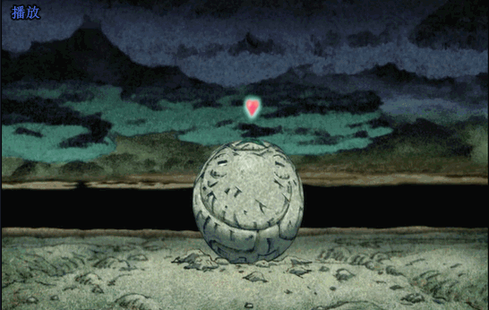

这时天空中有一颗光球出现，掠过地面附近的时候，地面上的圆球“爱心”感应般雀跃而出。

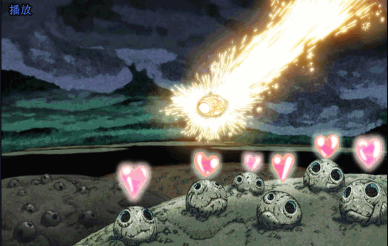

有脑洞的圆球，同样受到了刺激，内心不断的回想着刚开的情景，努力的想要产出“爱心”，在别的圆球纷纷再次潜入地下之际，它成功的生成了一颗新的“爱心”！

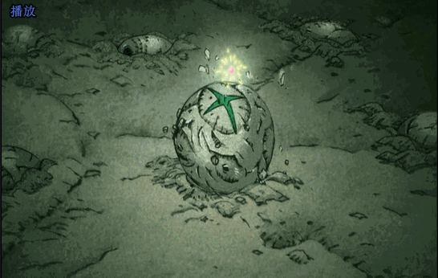

没想到的是，这次的“爱心”有了意识一般，脱离了自己头部。

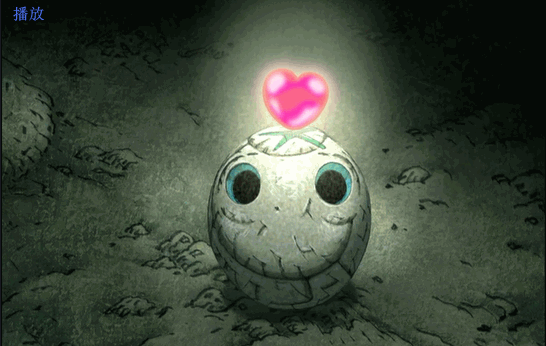

有脑洞的圆球追逐着自己的“爱心”，最后吃掉了“爱心”，意想不到的情况发生了。圆球的双眼不断溢出液体，向天空延伸。

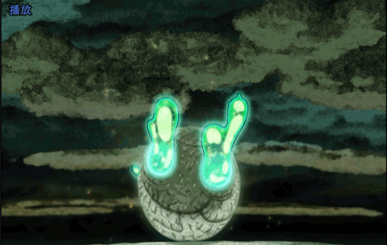

液体变成了一种全新的形态，其顶部核心是圆球的形状。

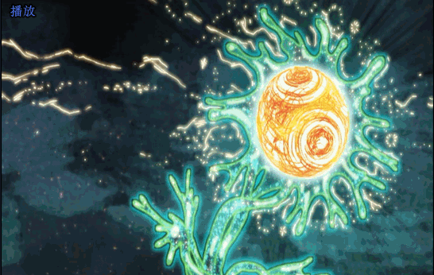

最终展开双翅，飞向了天空高处。

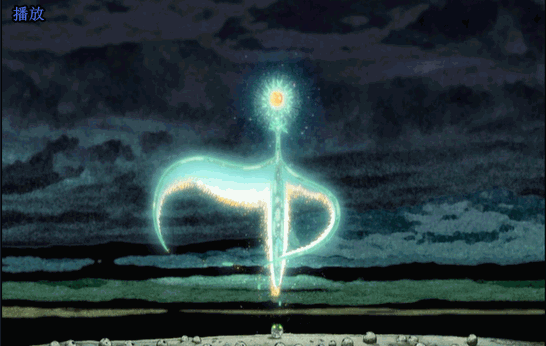

周围的其它圆球，激动不已，“爱心”全部都雀跃而出。这时，有脑洞的圆球，发出闪电链一样的光束，刺激周围的圆球的“爱心”，一传二，二传四，一直传递下去，所有的圆球仿佛被点燃一样。

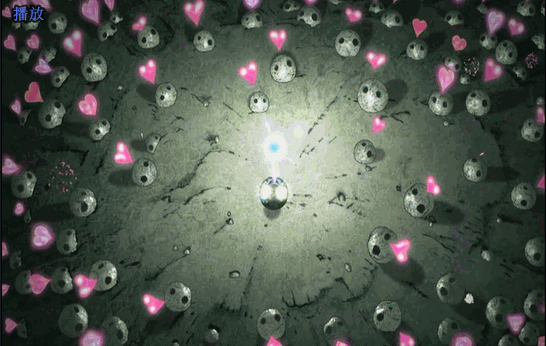

最后出现了影片的名称。

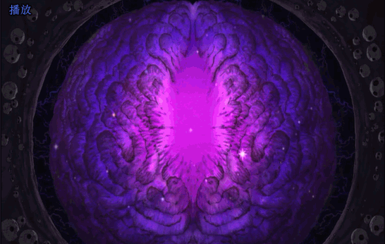

到这里差不多就结束了。从头到尾都很吸引人的眼球。看完后个人认为，这个短篇描述是，一种创新想法产生的过程，将人的思维过程具象化，感觉很有意思。网上也有其它的一些解读，比如什么意识流，什么大鸟暗喻剽窃他人创意什么的。只能说一千个读者眼里有一千个哈姆雷特。
